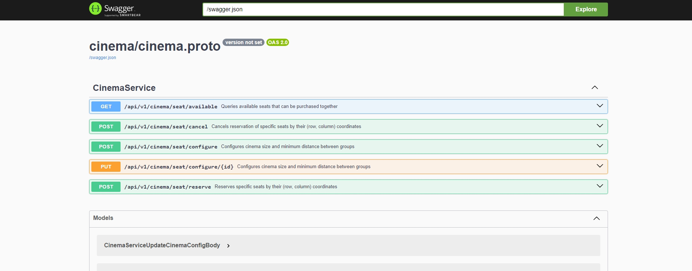

# Seating Arrangement

---

### TLDR
Install all required packages and Run command
```
go run main.go
```

Then Go to `http://localhost:8045/swagger-ui/` to interact with API



#### Requirements for developments:
```text
go1.23.2
buf 1.14.0
protoc
grpc-gateway
```

#### Generate protos:
```shell
buf generate
```

Repository structure:
```text
├───controller                  // contain our handlers
├───gen                         // auto-generated
│   ├───buf
│   │   └───validate
│   ├───cinema
│   ├───google
│   │   └───api
│   └───protoc-gen-openapiv2
│       └───options
├───internal                    // libs and utils
│   ├───helper
│   ├───libs
│   │   ├───assert
│   │   ├───generic
│   │   ├───logger
│   │   └───util
│   └───model                   // models & methods of Cinema object
├───proto                       // protobuf definition
│   └───cinema
├───repository                  // storage  layer
├───service                     // main logics
└───www                         // open api docs
```
